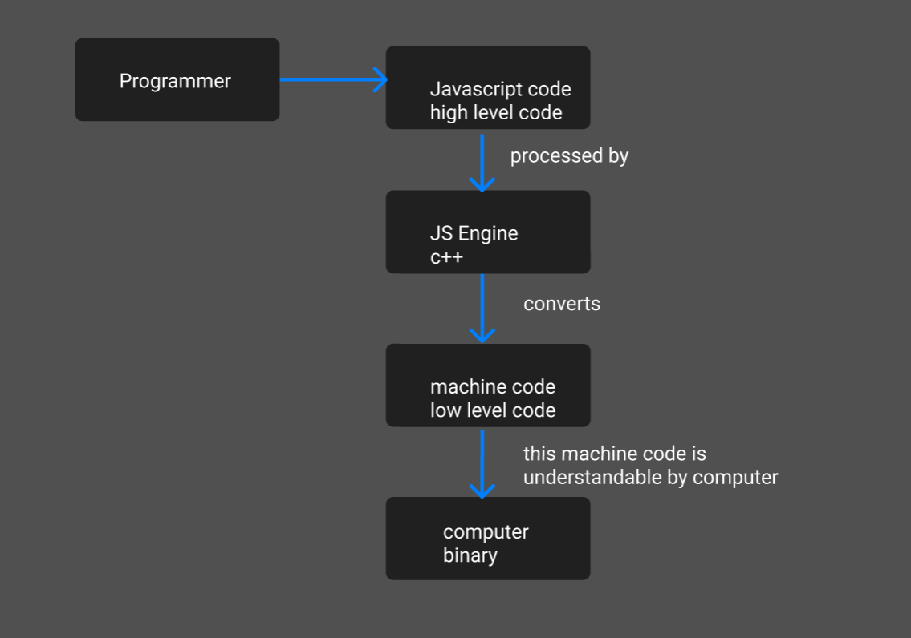

# JS ON SERVER

## ⭐ What is server?

A server is a powerful computer or software system that provides services, data, or resources to other computers, known as clients, over a network. Servers can host websites, manage email, store files, run applications, and perform many other functions that support the operations of businesses and organizations. They are designed to handle multiple requests simultaneously, ensuring that the clients they serve can access the necessary data or services efficiently and reliably. In essence, servers are the backbone of the internet and many local networks, facilitating communication and resource sharing among various devices.

## ⭐ NodeJS is C++ code?

Yes, Node.js contains C++ code. While Node.js itself is primarily written in JavaScript, it uses C++ to interact with lower-level system resources and perform high-performance tasks. Specifically, Node.js relies on the **V8 JavaScript engine, developed by Google, which is written in C++** and responsible for executing JavaScript code.

## ⭐ V8 Javascript Engine 

V8 is Google’s open source high-performance JavaScript and WebAssembly engine, **written in C++**. It is used in Chrome and in Node.js, among others. It implements ECMAScript and WebAssembly, and runs on Windows, macOS, and Linux systems that use x64, IA-32, or ARM processors. **V8 can be embedded into any C++ application.**

> [!NOTE]
> V8 Engine executes the JS code to machine code.

> [!NOTE]
> NodeJS is a C++ application with V8 embedded into it.

## ⭐ ECMAScript

ECMAScript (ES) is a standardized scripting language specification that serves as the foundation for JavaScript and other similar languages. ECMAScript defines the syntax, types, objects, and functionalities of a scripting language, ensuring that implementations like JavaScript maintain consistency and compatibility.

**JavaScript engines like V8 (by Google), SpiderMonkey (by Mozilla), Chakra (by Microsoft), and JavaScriptCore (by Apple) adhere to the ECMAScript standard to ensure consistent behavior of JavaScript code across different environments and platforms.**

Adherence to ECMAScript ensures that JavaScript code behaves the same way across different environments (browsers, Node.js, etc.), providing a consistent experience for developers and users.

## ⭐ V8 Engine is a C++ code?

## 🌐 Links

[WRITTEN NOTES](https://drive.google.com/drive/folders/1QIc3sQdEhRf9X6LEYXfJfNLNDLTkZjhO?usp=drive_link)