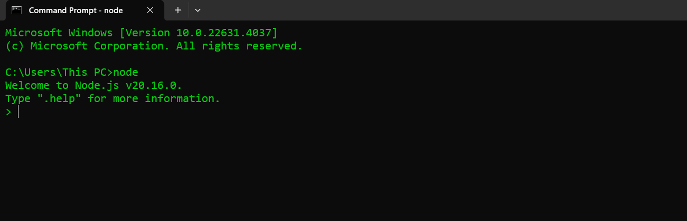
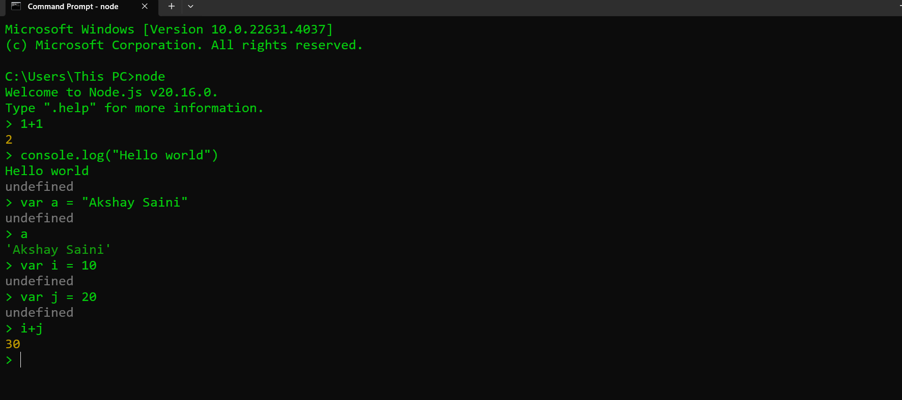
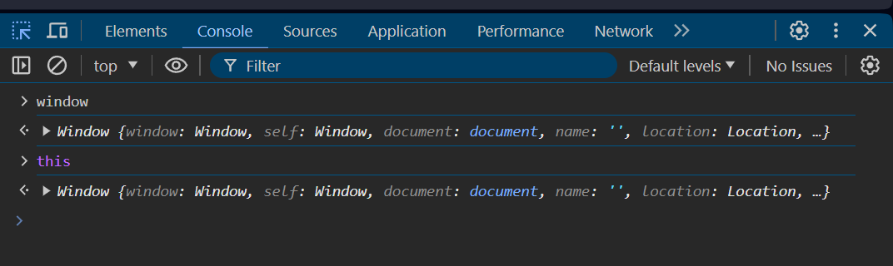
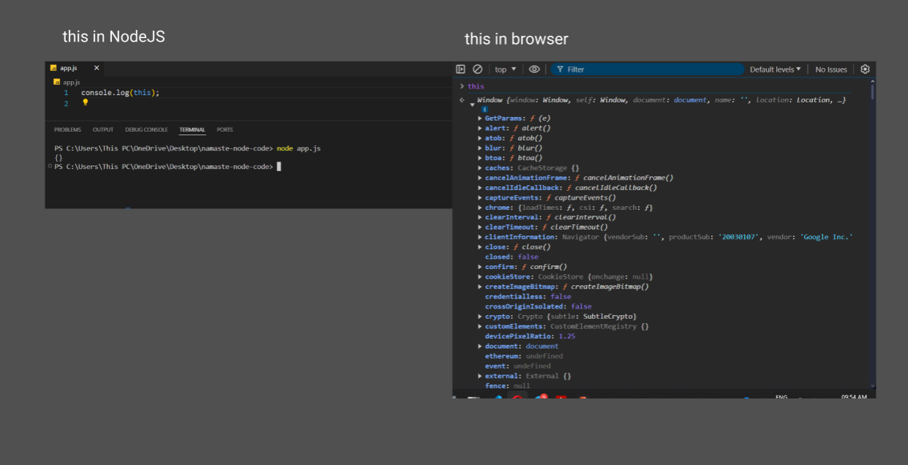
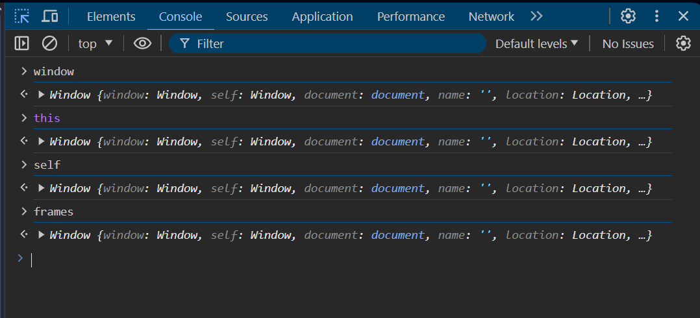
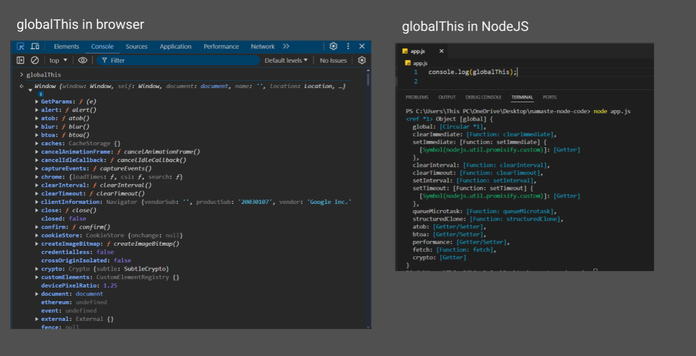

# LETS WRITE CODE 

<div align="center">

</div>

## ⭐ Node REPL

Read, Evaluate, Print, Loop

```cmd
node
```




> [!NOTE]
> NodeJS is JS runtime Environment

## ⭐ First Code in VS Code

```js
var name = "Namaste NodeJS";
console.log(name);

var a = 10;
var b = 20;
console.log(a + b);
```

```cmd
Namaste NodeJS
30
```

## 🔥 `window` and `this` object in browser



## ⭐ `global` Object

In Node.js, the `global` object is a special object that provides a way to access globally available functions, modules, and variables. Unlike the browser environment where the global object is `window`

> [!IMPORTANT]
> `global` object is not a part of V8 Engine

```js
console.log(global);
```

```cmd
<ref *1> Object [global] {
  global: [Circular *1],
  clearImmediate: [Function: clearImmediate],
  setImmediate: [Function: setImmediate] {
    [Symbol(nodejs.util.promisify.custom)]: [Getter]
  },
  clearInterval: [Function: clearInterval],
  clearTimeout: [Function: clearTimeout],
  setInterval: [Function: setInterval],
  setTimeout: [Function: setTimeout] {
    [Symbol(nodejs.util.promisify.custom)]: [Getter]
  },
  queueMicrotask: [Function: queueMicrotask],
  structuredClone: [Function: structuredClone],
  atob: [Getter/Setter],
  btoa: [Getter/Setter],
  performance: [Getter/Setter],
  fetch: [Function: fetch],
  crypto: [Getter]
}
```

* This `global` object access is given inside V8 Engine.

* V8 doesn't understand `global`. it only understands `global` when NodeJS gives access to the V8 Engine.

### 🔥 `global` object has access to

1. `clearInterval`

2. `clearTimeout`
3. `setInterval`
4. `setTimeout`


### 🔥 console log `this`

```js
console.log(this);
```

```cmd
{}
```



### 🔥In the Brower if we write `Window`, `this`, `self`,`frames` all of these given you the global Object.



* Browser named it **`window`**

* Concept **`this`** pointing to the global object.

* In Web workers **`self`** points to the global object.

* NodeJS started using **`global`** as a global object.

* Because of this there is lot of confusion and after that **OpenJS Foundation** comes up with a standard global object for the runtime environment and there should be a single way to represent it.

* So, finally **OpenJS Foundation** comes up with **`globalThis`** and **`globalThis`** refers to **global** object in all javascript runtime.



> app.js
```js
console.log(globalThis === global)
```

```cmd
true
```