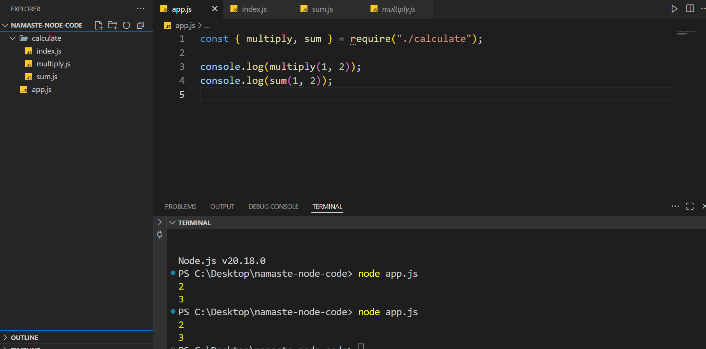

# MODULE.EXPORT & REQUIRE

## ⭐ Importing and Exporting in NodeJS

To import a function from a module, use the `require` function. Here's an example:

```js
//xyz.js

console.log("message from xyz")
```

```js
// app.js

require("./xyz.js");

console.log("message from app.js");
```

#### 💻 Output
```cmd
message from xyz
message from app.js
```

---

### ⚡Importing a function from another module

```js
// sum.js

function calculateSum(a, b) {
  const sum = a + b;
  console.log(sum);
}
```

```js
// app.js

require("./sum.js");

console.log("message from app")
calculateSum(10,20);
```

#### 💻 Output

```cmd
calculateSum(10,20);
^

ReferenceError: calculateSum is not defined
```

---


```js
// sum.js

console.log("sumjs module executing");

function calculateSum(a, b) {
  const sum = a + b;
  console.log(sum);
}
```

```js
// app.js

require("./sum.js");

console.log("message from app")
calculateSum(10,20);
```

#### 💻 Output

```cmd
sumjs module executing

calculateSum(10,20);
^

ReferenceError: calculateSum is not defined
```

> [!NOTE]
> we cannot simply import function from one module to another module simply by `require`

*  **Modules protects their variables and functions from leaking.**

---

### ⚡ Exporting a Functions and variables from module

We can export functions and variables with `module.exports`

```js
// sum.js

function calculateSum(a, b) {
  const sum = a + b;
  console.log(sum);
}

module.exports = calculateSum;
```

```js
// app.js

const calculateSum = require("./sum.js");

console.log("message from app")
calculateSum(10,20);
```

#### 💻 output

```cmd
message from app
30
```

---

### ⚡ importing and exporting multiple variables and functions from modules

> [!NOTE]
> we can use variables and functions from modules with export

```js
// sum.js

function calculateSum(a, b) {
  const sum = a + b;
  console.log(sum);
}

const x = "Variable from sum.js";

module.exports = {
  x: x,
  calculateSum: calculateSum,
};
```

```js
// app.js

const obj = require("./sum.js");
// const { x, calculateSum } = require("./sum.js");

obj.calculateSum(10, 20);
console.log(obj.x);
```

#### 💻 output 

```cmd
30
Variable from sum.js
```

---

### ⚡ Destrucing an object

```js
//app.js
 
const { x, calculateSum } = require("./sum.js"); ✅
```

---

### ⚡ valid exports

```js
// sum.js

module.exports = { x, calculateSum };  ✅
```

---

## ⭐ `.cjs` and `.mjs` Modules

### ⚡ CommonJS Module (.cjs)

* CommonJS (CJS) is the original module system used in Node.js.

* To export something from a module, you use `module.exports` or `exports`.

* To import a module, you use the `require` function.

* Synchronous loading

* non-strict mode


#### 💻 Exports

```js
module.exports = someFunction;
```

```js
module.exports = { x, someFunction }
```

```js
module.exports.x = x;
module.exports.someFunction = someFunction;
```

#### 💻 Imports

```js
require("./sum.js");
```

```js
const { x, someFunction } = require("./sum.js")
```

---

### ⚡ ECMAScript Modules (ESM or MJS)

* by default used in React, Angular, (etc)

* To export something from a module, you use the `export` keyword.

* To import a module, you use the `import` keyword.

* Asynchronous loading

* strict mode

```json
// package.json

{
    "type": "module"
}
```

#### 💻 Exports

```js
export function someFunction() {
    console.log("hello world");
}

export const x = 10;
```

```js
function someFunctionm() {
    console.log("hello world");
}

const x = 10;

export { someFunction, x }
```

#### 💻 Imports

```js
import { someFunction, x } from "./sum.js"
```

---

### ⚡ non-strict mode in `CommonJS`

```js
a = 10

console.log(a);
```

#### 💻 output

```cmd
10
```

### ⚡ strict mode in `module`

```js
a = 10   ❌
```

#### 💻 output

```cmd
ReferenceError: a is not defined
```

---

### ⚡ Import `.json` file 

```json
// data.json

{
  "name": "Ameer khan",
  "city": "Tenkasi",
  "country": "India"
}
```

```js
const data = require("./data.json");

console.log(JSON.stringify(data));
console.log(data)
```

---

## ⭐ Creating own module 

```js
// /calculate/sum.js

const sum = (a,b) => {
    return a + b;
} 

module.exports = sum;
```

```js
// /calculate/multiply.js

const multiply = (a, b) => {
    return a * b;
}

module.exports = multiply;
```

```js
// /calculate/index.js

const multiply = require("./multiply.js");
const sum = require("./sum.js");

module.exports = { multiply, sum };
```


```js
// app.js

const { multiply, sum } = require("./calculate");

console.log(multiply(1, 2));
console.log(sum(1, 2));
```



we can able to call `multiply` and `sum` function from the `calculate/index.js` without particular `index.js`.