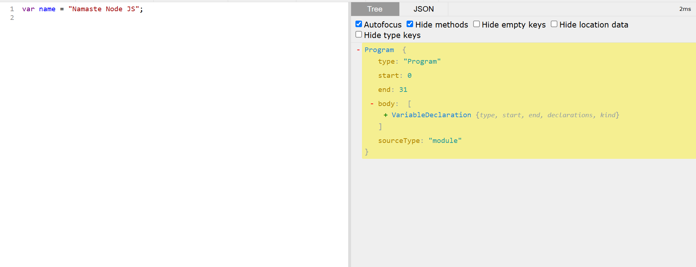
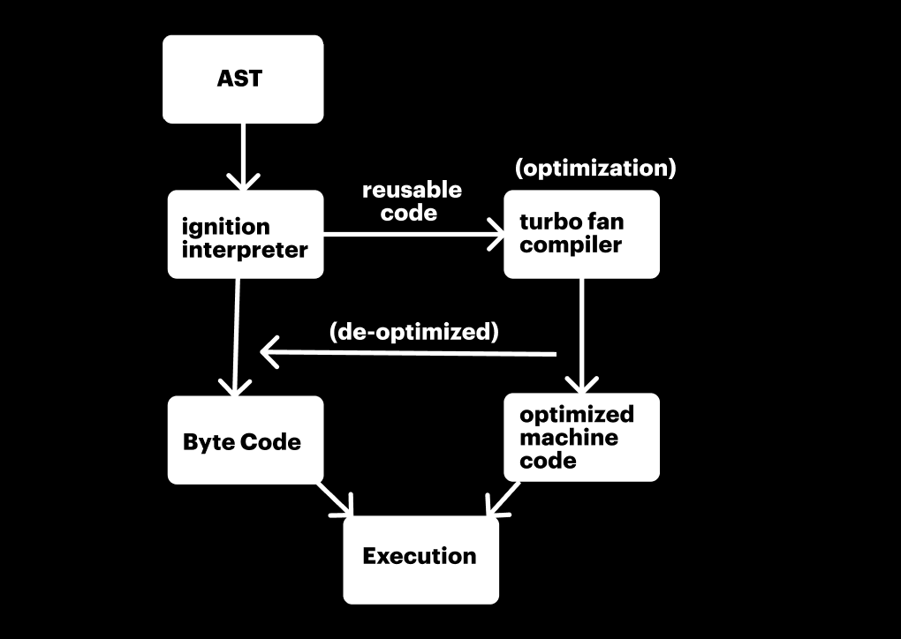

# Deep Dive into V8 JS Engine


The V8 Engine is Google’s high-performance JavaScript engine, developed for Chrome but also used in Node.js to execute JavaScript on the server side. 

## ⭐ Parsing 

* Parsing is the process of converting JavaScript code into a structured format that the V8 engine can understand and execute.

### ⚡ Tokenization (Lexial Analysis)

The source code is broken down into tokens (keywords, identifiers, operators, etc.).

```js
let sum = a + b;
```

Tokens produced 

* `let` (keyword)

* `sum` (identifier)
* `=` (assignment operator)
* `a` (identifier)
* `+` (operator)
* `b` (identifier)
* `;` (terminator)


### ⚡ Abstract Syntax Tree (AST)

* The tokenized code is converted into an AST (Abstract Syntax Tree).

* The AST represents the structure and hierarchy of the JavaScript code.


```js
let sum = a + b;
```

```css
VariableDeclaration
 ├── Identifier (sum)
 ├── Assignment (=)
 ├── BinaryExpression (+)
       ├── Identifier (a)
       ├── Identifier (b)
```




> [!IMPORTANT]
> JS is Interpreted or compiled language //
> answer: Both

| Interpreted | Compiled |
| --------- | --------- |
| Executed line by line | First compliation, high-level code converted into low-level machine code |
| fast initial execution| initial heavy but executed fast |
| interpreter is there | compiler is there  |

## ⭐ JIT - Just In Time compiler 

A Just-In-Time (JIT) Compiler in JavaScript is a hybrid approach that combines interpretation and compilation to optimize code execution dynamically at runtime.

In the V8 engine (used in Node.js and Chrome), the JIT compiler converts frequently executed JavaScript code into highly optimized machine code to improve performance.



### ⚡ Ignition Interpreter 

* The AST is passed to Ignition, the interpreter of V8.

* Ignition converts AST into bytecode, an intermediate representation of the code.

* Bytecode is lighter and faster than the AST and can be executed immediately.

### ⚡ Hot Code detection 

* V8 monitors execution to detect "hot code" (frequently executed functions).

* If a function runs many times, it is marked as hot and sent to TurboFan (JIT Compiler) for optimization.

* Optimizing frequently used functions speeds up execution.

* Avoids wasting time optimizing rarely used code.

### ⚡ Turbo Fan compiler 

* TurboFan takes the hot code (frequently executed bytecode) and compiles it into optimized machine code.

    * ✅ Inline Caching → Caches function calls and property accesses.

    * ✅ Hidden Classes → Uses efficient object representations.

    * ✅ Dead Code Elimination → Removes unused variables.

    * ✅ Loop Unrolling → Optimizes frequently executed loops


### ✨ TurboFan makes assumptions 

* TurboFan (the JIT compiler in V8) assumes the most common types used in JavaScript to optimize execution.

* However, if those assumptions turn out wrong, it deoptimizes and falls back to slower execution.

### ✨ Garbage collection

V8 (the JavaScript engine used in Node.js and Chrome) has an advanced garbage collection (GC) system that automatically manages memory by cleaning up unused objects. The two major components are:

* **Orinoco** → V8's main JavaScript garbage collector.

* **Oilpan** → Garbage collector for DOM & WebAssembly objects (C++ objects).

* **Scavenger (Minor GC)** → Fast cleanup of young objects in memory.
* **Mark-Compact (Major GC)** → Deep cleanup of long-lived objects in memory.
