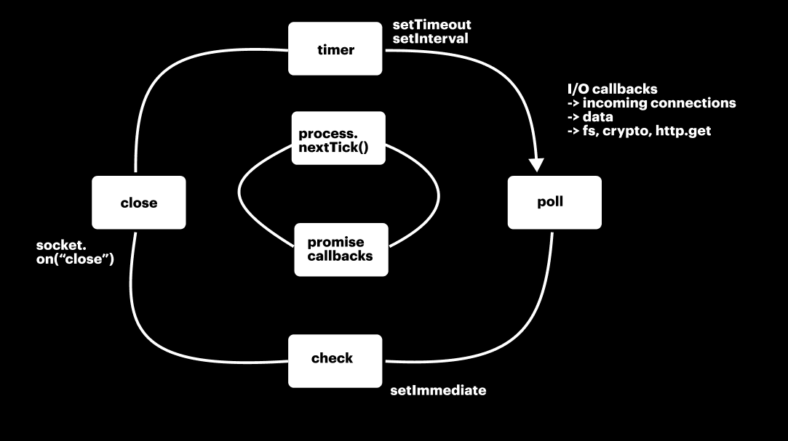

# LIBUV AND EVENT LOOP

## ⭐ Event Loop

The event loop is the core mechanism that handles asynchronous operations in Node.js. It ensures non-blocking I/O by offloading tasks like:

* File system operations (`fs.readFile`)

*  Network requests (`http.get`)
*  Timers (`setTimeout`, `setInterval`)
*  Process operations (`process.nextTick`, `setImmediate`)

Even though JavaScript is single-threaded, the event loop allows Node.js to perform tasks in the background asynchronously.

* libuv is a C++ library that provides the event loop and thread pool to handle asynchronous tasks in Node.js.

* It is responsible for handling I/O operations using multiple threads, even though Node.js runs JavaScript in a single thread.

