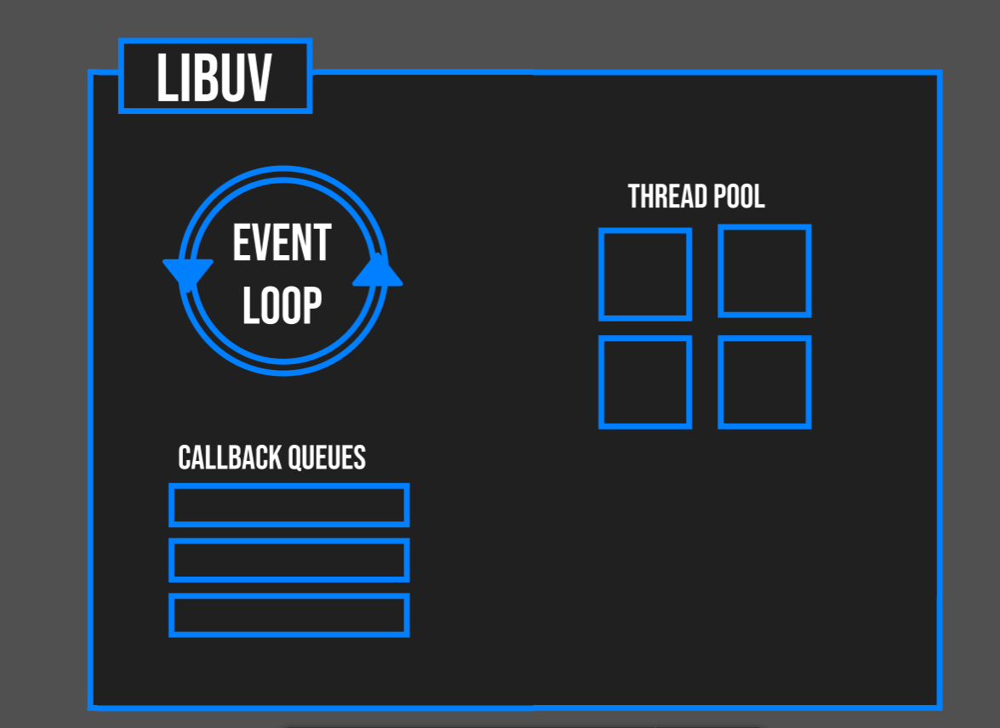
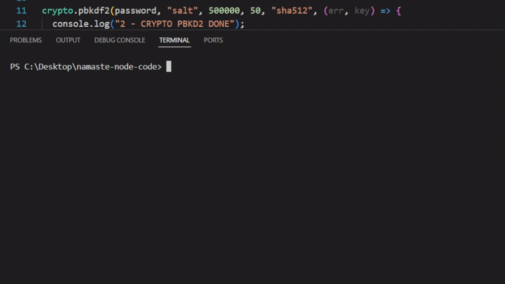

# Thread Pool in Libuv 

There are extra 2 phases in the event loop cycle 

1.  pending callbacks 

2.  idle, prepare 

---

## ⭐ Phases Overview

1. **timers**: this phase executes callbacks scheduled by `setTimeout()` and `setInterval()`.

2. **pending callbacks**: executes I/O callbacks deferred to the next loop iteration.

3. **idle, prepare**: only used internally.

4. **poll**: retrieve new I/O events; execute I/O related callbacks (almost all with the exception of close callbacks, the ones scheduled by timers, and `setImmediate()`); node will block here when appropriate.

5. **check**: `setImmediate()` callbacks are invoked here.
6. **close callbacks**: some close callbacks, e.g. `socket.on('close', ...)`.


> [!NOTE]
> One full cycle of the event loop is called **tick**

---

### ⚡ EVENT LOOP FROM NODE.JS

```
   ┌───────────────────────────┐
┌─>│           timers          │
│  └─────────────┬─────────────┘
│  ┌─────────────┴─────────────┐
│  │     pending callbacks     │
│  └─────────────┬─────────────┘
│  ┌─────────────┴─────────────┐
│  │       idle, prepare       │
│  └─────────────┬─────────────┘      ┌───────────────┐
│  ┌─────────────┴─────────────┐      │   incoming:   │
│  │           poll            │<─────┤  connections, │
│  └─────────────┬─────────────┘      │   data, etc.  │
│  ┌─────────────┴─────────────┐      └───────────────┘
│  │           check           │
│  └─────────────┬─────────────┘
│  ┌─────────────┴─────────────┐
└──┤      close callbacks      │
   └───────────────────────────┘
```

### ⚡ EVENT LOOP FROM LIBUV


    ---

### ⚡ EVENT LOOP WAITS IN POLL PHASE WHEN IDLE 

Here the code,

```c 
 can_sleep =
        uv__queue_empty(&loop->pending_queue) &&
        uv__queue_empty(&loop->idle_handles);
```

---

# 💚 THREAD POOL 



> [!NOTE]
> thread pool size is 4 by default

### ⚡ Why the thread pool is needed for file system in Node.js?

* Node.js is single-threaded at the JavaScript level.

* OS does not provide non-blocking APIs for disk I/O on most platforms.
(e.g., `read()` on a file blocks the calling thread until the data is read).

* If Node.js did file I/O directly in the main thread, the event loop would freeze until the operation completed. That would block all JavaScript execution.

* **ThreadPool size is 4 by default** `UV_THREADPOOL_SIZE = 4`

* If 5 Async operations like file reading happens,

**Libuv uses its thread pool to offload file system work:**

```js
const fs = require("fs");

fs.readFile("big.txt", "utf8", (err, data) => {
  console.log("Done reading file!");
});
```


* `fs.readFile` is implemented using libuv.

* Libuv queues a "work request" into its thread pool

* A free thread from the pool executes the blocking system call.

* Copies the file content into memory.

* The thread signals the event loop by putting the result in the pending queue.

* The event loop picks it up and runs your callback `((err, data) => {...})`.

---

#### ❓ NodeJS is single threaded or multithreaded 

* Node.js is both single-threaded and multithreaded, depending on the perspective.

1. **From the JavaScript side → Single-threaded**

    * Your JS code runs on a single main thread (the event loop).

    * There’s only one call stack for executing your JavaScript.

2. **From the libuv side → Multithreaded**

    * Node.js relies on libuv, which provides:

    * An event loop (single thread).

    * A thread pool (default 4 worker threads, configurable up to 128).

    * These worker threads handle blocking operations, such as:

        * File system calls (`fs.readFile`, `fs.writeFile`, etc.).

        * DNS lookups.

        * Some crypto functions (`crypto.pbkdf2`, `crypto.scrypt`).

        * Compression (`zlib`).

---

### ⚡ CRYPTO EXAMPLE 

```js
const fs = require("fs");
const crypto = require("crypto");

const password = "Password@123";
crypto.pbkdf2(password, "salt", 500000, 50, "sha512", (err, key) => {
  console.log("1 - CRYPTO PBKD2 DONE");
});

crypto.pbkdf2(password, "salt", 500000, 50, "sha512", (err, key) => {
  console.log("2 - CRYPTO PBKD2 DONE");
});

crypto.pbkdf2(password, "salt", 500000, 50, "sha512", (err, key) => {
  console.log("3 - CRYPTO PBKD2 DONE");
});


crypto.pbkdf2(password, "salt", 500000, 50, "sha512", (err, key) => {
  console.log("4 - CRYPTO PBKD2 DONE");
});
```

#### OUTPUT 

```
1 - CRYPTO PBKD2 DONE
2 - CRYPTO PBKD2 DONE
3 - CRYPTO PBKD2 DONE
4 - CRYPTO PBKD2 DONE
```

* There are 4 UV_THREADPOOL, each I/O operation takes place in each 4 of the thread pool.

---

Now see this code,

```js
const fs = require("fs");
const crypto = require("crypto");

const password = "Password@123";
crypto.pbkdf2(password, "salt", 500000, 50, "sha512", (err, key) => {
  console.log("1 - CRYPTO PBKD2 DONE");
});

crypto.pbkdf2(password, "salt", 500000, 50, "sha512", (err, key) => {
  console.log("2 - CRYPTO PBKD2 DONE");
});

crypto.pbkdf2(password, "salt", 500000, 50, "sha512", (err, key) => {
  console.log("3 - CRYPTO PBKD2 DONE");
});


crypto.pbkdf2(password, "salt", 500000, 50, "sha512", (err, key) => {
  console.log("4 - CRYPTO PBKD2 DONE");
});

crypto.pbkdf2(password, "salt", 500000, 50, "sha512", (err, key) => {
  console.log("5 - CRYPTO PBKD2 DONE");
});
```

#### OUTPUT


```
3 - CRYPTO PBKD2 DONE
2 - CRYPTO PBKD2 DONE
4 - CRYPTO PBKD2 DONE
1 - CRYPTO PBKD2 DONE
```~[WAITING FOR THREAD TO BE EMPTY]~```
5 - CRYPTO PBKD2 DONE
```

#### ❓ CAN YOU CHANGE TO SIZE OF THREAD POOL

**YES**, 
```js
process.env.UV_THREADPOOL_SIZE = 2
```

or in cmd prompt

```
$env:UV_THREADPOOL_SIZE=3; node threadpool.js
```

#### ⚡CONSIDER THIS CODE EXAMPLE

```js
const fs = require("fs");
const crypto = require("crypto");

process.env.UV_THREADPOOL_SIZE = 3;

const password = "Password@123";
crypto.pbkdf2(password, "salt", 500000, 50, "sha512", (err, key) => {
  console.log("1 - CRYPTO PBKD2 DONE");
});

crypto.pbkdf2(password, "salt", 500000, 50, "sha512", (err, key) => {
  console.log("2 - CRYPTO PBKD2 DONE");
});

crypto.pbkdf2(password, "salt", 500000, 50, "sha512", (err, key) => {
  console.log("3 - CRYPTO PBKD2 DONE");
});


crypto.pbkdf2(password, "salt", 500000, 50, "sha512", (err, key) => {
  console.log("4 - CRYPTO PBKD2 DONE");
});

crypto.pbkdf2(password, "salt", 500000, 50, "sha512", (err, key) => {
  console.log("5 - CRYPTO PBKD2 DONE");
});
```

#### OUTPUT



---

#### ❓ when we are creating web server in nodejs the api uses thread pool?

NO

* Network APIs (HTTP, TCP, UDP, etc.) in Node.js do **NOT** use the thread pool

---

## ⭐ EPOLL AND KQUEUE

* epoll (Linux)

* kqueue (MacOS)


---

* `epoll` is a scalable I/O event notification system.

---

important points to cover 

1. epoll

2. kqueue
3. event emitter 

---
