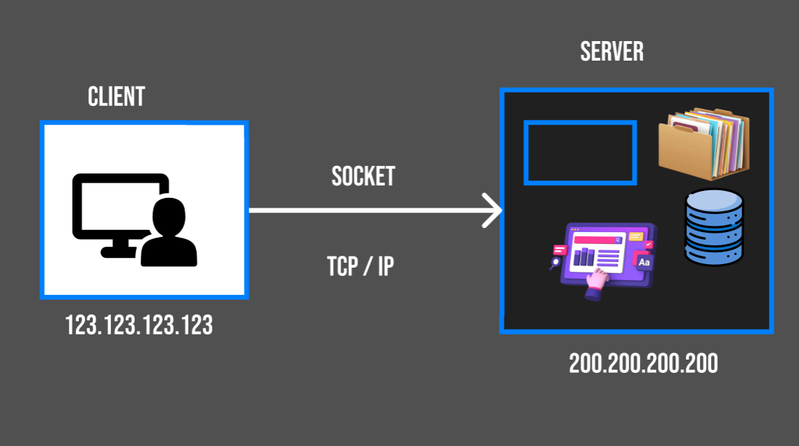

# Creating a Server 

## ⭐ WHAT IS SERVER ?

A server is basically:

* A computer program (or hardware)

* That listens for requests from clients (like browsers, mobile apps, or other programs)

And then sends back responses.

#### The word “server” can mean either:

* **Hardware** → a physical machine (like a powerful computer in a data center).

* **Software** → the program running on that machine (like a Node.js HTTP server, Apache, Nginx)

### ⚡ AWS EC2 instance has more capable compare to our personal computer 

### 1. Availability & Uptime

**Personal Computer** → Only works when it’s ON, connected to the internet, and not sleeping. If your laptop shuts down → your server is gone.

**EC2 Instance** → Runs in AWS data centers with 24/7 power, redundant internet connections, and high uptime (99.99%). Your server stays online all the time.

### 2. Scalability

**Personal Computer** → Limited CPU, RAM, and bandwidth. If 10,000 people hit your app, your PC will crash.

**EC2 Instance** → You can instantly scale up (bigger machine type) or scale out (load balancers, auto-scaling groups) to handle massive traffic.

### 3. Global Reach

**Personal Computer** → Your home internet is usually slow, and clients worldwide will face high latency.

**EC2 Instance** → AWS has data centers worldwide (US, Europe, Asia, etc.). You can launch your server close to your users, reducing latency.

### 4. Security

**Personal computer** → Exposing it as a public server is dangerous (malware, DDoS attacks, hackers). Home networks aren’t designed for enterprise-grade security.

**EC2 Instance** → Built-in firewalls (Security Groups), IAM roles, encryption, DDoS protection, and patching support.

### 5. Maintenance

**Personal Computer** → Hardware failures (power supply, hard disk, fan overheating). If your PC dies, your server is down until you fix it.

**EC2 Instance** → AWS maintains the hardware. If one server fails, AWS automatically moves your instance to healthy hardware.

### 6. Elastic Pricing

**Personal Computer** → You’ve already bought it, but it’s fixed power. If idle, it wastes electricity and resources.

**EC2 Instance** → Pay only for what you use. You can run a server for a few hours and stop it, and you only pay for those hours.

### 7. Integration with Cloud Services

**Personal Computer** → Just a standalone machine. If you need a database, file storage, load balancer → you must set up everything manually.

**EC2 Instance** → Can integrate with AWS services (RDS for databases, S3 for storage, CloudFront for CDN, ELB for load balancing, etc.) in minutes.

---

* Whenever the client requested the server. one socket connection will made. 

* which uses TCP/IP protocol, which sends data using TCP/IP protocol.

### What is TCP/IP?

TCP/IP (Transmission Control Protocol / Internet Protocol) is the foundation of the internet.
It’s a set of rules (protocols) that computers use to communicate over networks (like LAN, WAN, or the Internet).

Think of it as the language of the internet.