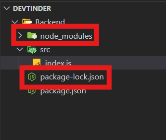

# Creating our Express Server 


###  ⚡Initialise the App

```cmd
npm init
```

### ⚡Installing Express

```cmd
npm i express
```

### ⚡ we will get `node_modules` and `package-lock.json`



---

### ⚡ `package.json`

* **Project metadata** → name, version, description, author, license, etc.

* **Scripts** → commands like npm start, npm test.

* **Dependencies** → libraries your app needs to run.

* **DevDependencies** → libraries only needed for development (like testing tools).

### ⚡ `package-lock.json`

* When you install any package, npm creates/updates a file called package-lock.json.

* Records the exact version of every installed dependency (and its sub-dependencies).

* Ensures consistency across environments (if you or your teammates install the project later, you’ll all get the same versions).

* Optimizes performance by allowing npm to skip re-resolving versions.


### ⚡ What is `^` caret meaning

```json
"dependencies": { "express": "^5.1.0" }
```

* The caret (`^`) in npm versioning is a semantic versioning (semver) range operator.

* A version like `5.1.0` follows

```cmd
MAJOR.MINOR.PATCH
```

* **MAJOR** → breaking changes (5 → 6 means old code may break).

* **MINOR** → new features, backward compatible (5.1 → 5.2).

* **PATCH** → bug fixes only (5.1.0 → 5.1.1).


#### 📌 What `^` means

`^5.1.0` → means allow anything from `5.1.0` up to (but not including) `6.0.0`.

So it can install:

* `5.1.0` ✅

* `5.1.2` ✅

* `5.5.0` ✅

But not `6.0.0` ❌ (major version bump).

#### 📌 What `~` means

```json
"express": "~5.1.0"
```

Allow upgrades for PATCH versions only, not MINOR.

So it will install:

* **`5.1.0`** ✅

* **`5.1.1`** ✅

* **`5.1.9`** ✅

But not **5.2.0** ❌ (because that’s a new MINOR version).