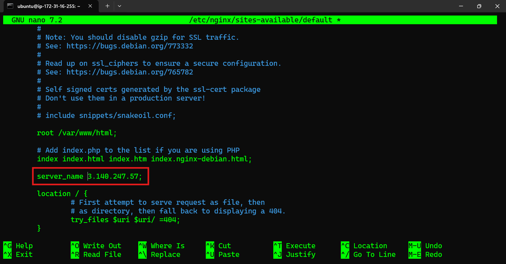
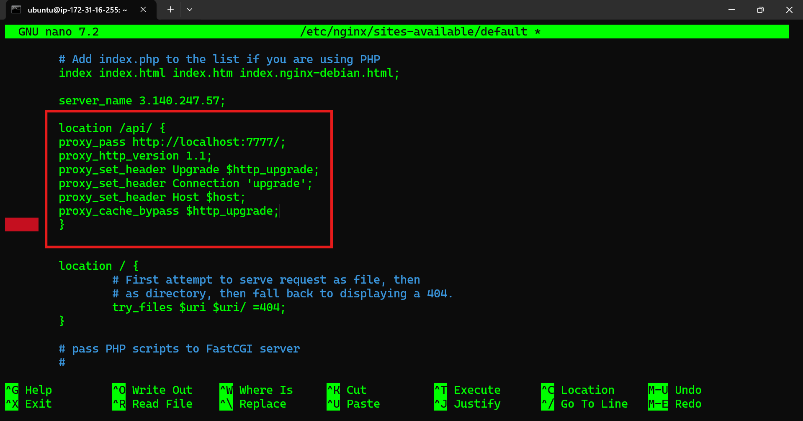

# Nginx & Backend Node App Deployment

## ⭐ 1. PM2 installation

```cmd
npm install pm2 -g
```

## ⭐ 2. starting pm2 

```cmd
pm2 start npm -- start
```

### ⚡ pm2 commands 

```cmd
pm2 flush <name>

pm2 list 

pm2 log

pm2 delete <name>

pm2 stop <name>
```

### ⚡ pm2 custom names 

```cmd
pm2 start npm --name "something" -- start
```

## ⭐ 3. configuring nginx proxy pass 

```cmd
sudo nano /etc/nginx/sites-available/default
```

### change the server name to ip address 




### proxy pass 



## ⭐ 4. Restart nginx

```cmd
sudo systemctl restart nginx
```